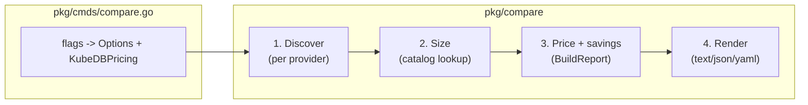

# resource-calculator design

This document describes the architecture of the `resource-calculator` CLI, with
a focus on the `compare` command (cloud database to KubeDB savings estimator).
For end-user instructions see [README.md](README.md) and
[docs/compare.md](docs/compare.md).

## 1. Goals

`resource-calculator` is a single Cobra binary, shipped both standalone and as a
`kubectl` plugin. It has two jobs:

1. Measure resource usage of databases already running on Kubernetes
   (`calculate`, `convert`, `check-deprecated`).
2. Measure databases running on managed clouds and DBaaS vendors and estimate
   the savings of moving them to KubeDB (`compare`).

The `compare` command is designed around three principles:

- One metric. KubeDB is licensed on memory allocated to database servers
  (replicas times memory per replica). Everything reduces to that single number
  so the model is simple and matches the bill after migration.
- Pluggable discovery. Where databases live and how they are read is decoupled
  from how they are sized, priced and reported.
- Official SDKs by default, with fallbacks. Live discovery uses each vendor's
  official Go SDK; the CLI, REST, and file-import sources remain available for
  environments where the SDK is not wanted.

## 2. Command tree

```
resource-calculator
  calculate          sum CPU/memory/storage of cluster workloads
  convert            KubeDB v1alpha1 -> v1alpha2
  check-deprecated   list KubeDB resources on deprecated versions
  compare            estimate KubeDB migration savings
    aws | azure | gcp | oci | atlas | elastic | clickhouse | all
  completion
  version
```

`pkg/cmds/` holds the Cobra wiring. `compare` lives in `pkg/cmds/compare.go` and
delegates all logic to the `pkg/compare` package.

## 3. Pipeline

Every `compare` subcommand runs the same four-stage pipeline. Stages 2, 3 and 4
are provider agnostic, so adding or changing a provider only touches stage 1.



1. Discover: `DiscovererFor(provider).Discover(ctx, opts)` returns a normalized
   `[]ManagedDatabase` plus non-fatal warnings.
2. Size: each discoverer fills in `MemoryGiBPerNode`, `VCPUPerNode` and
   `NodeCount` using the sizing catalogs (`catalog.go`).
3. Price and savings: `BuildReport` aggregates memory, applies the KubeDB rate
   and computes savings against current managed spend.
4. Render: `Render` prints text, JSON or YAML.

## 4. Data model (`compare.go`)

```go
type ManagedDatabase struct {
    Provider         Provider // aws, azure, gcp, oci, atlas, elastic, clickhouse
    Service          string   // RDS, ElastiCache, Cloud SQL, Atlas, ...
    Engine           string   // postgres, mysql, redis, mongodb, ...
    Name             string
    Account, Region  string
    NodeType         string   // instance class / SKU / tier (informational)
    VCPUPerNode      float64
    MemoryGiBPerNode float64
    NodeCount        int      // replicas x shards x HA standbys
    MonthlyCostUSD   float64  // estimated current managed cost
    CostEstimated    bool
    Notes            string   // per-db warning (unknown type, serverless, ...)
}
```

`ManagedDatabase.TotalMemoryGiB() = MemoryGiBPerNode * NodeCount` is the KubeDB
billable memory for one database. The estate total is the sum over all of them.

`KubeDBPricing` encodes the license model: a flat USD per GiB per month rate,
separate for production and non-production, with a production memory floor
(`DefaultMinProdGiB = 100`). Rates default to zero (the public rate is
quote-based) and are supplied by the caller.

`Report` is the aggregated result: the database list (sorted by memory footprint
descending), totals, current spend, KubeDB cost, and savings (monthly, annual,
percent). `BuildReport(scope, dbs, pricing, warnings)` produces it. The savings
model is current managed spend minus KubeDB cost.

## 5. Discovery layer (`discover.go`)

```go
type Discoverer interface {
    Provider() Provider
    Discover(ctx context.Context, opts Options) ([]ManagedDatabase, []string, error)
}
```

`Options.Source` selects the mechanism, in priority order:

| Source | Meaning |
| --- | --- |
| `sdk`  | official cloud SDK (built in for AWS, Azure, GCP, OCI, Atlas, Elastic) |
| `cli`  | shell out to the provider CLI (aws/az/gcloud/oci) |
| `rest` | call the vendor REST API directly (Atlas, Elastic, ClickHouse) |
| `file` | parse exported JSON, no live calls or credentials |
| `auto` | file when `--from-file` is set, else the preferred live source (SDK where available, REST for ClickHouse) |

`DiscovererFor(provider)` returns the implementation. Each discoverer branches
on `opts.Source`; for `auto` it prefers the SDK. ClickHouse Cloud has no
official Go control-plane SDK, so it uses REST for both `sdk`-less `auto` and
explicit `rest`, and returns `errSDKNotBuiltIn` only for an explicit `--source=sdk`.

Each provider's SDK discoverer lives in its own `*_sdk.go` file and reuses the
same sizing (`catalog.go`) and pricing helpers as the CLI/REST/file paths, so
all sources produce identical `ManagedDatabase` records.

### Self-hosted operators (`compare operators`)

`compare operators` is a separate, cluster-scoped discovery path (not a cloud
`Source`). It uses the controller-runtime client with unstructured objects to
detect alternative database operators by their CRD group/version/kind and to
read each CR's pod memory limit (or request) and replica/size field,
normalizing to the same `ManagedDatabase`. The operator catalog and per-CR
extractors live in `operators.go`; the scan (`DiscoverOperators`) lives in
`kubernetes.go`. A second scan (`DiscoverImageWorkloads`, also in
`kubernetes.go`) inspects StatefulSet and Deployment container images and
counts databases shipped as Bitnami, Chainguard or Docker Hardened Images; the
image-to-engine catalog is in `images.go`. Only those three image families are
matched, so operator and upstream images are not double counted. The resulting `Report` is marked `SelfHosted`, so it renders a
per-operator breakdown and the KubeDB cost to manage the estate, with no
managed-spend or savings line (the alternatives are mostly open source). No
project is added to `go.mod`: detection and reading go entirely through
unstructured objects, and controller-runtime is already a dependency.

### The collector pattern

Hyperscaler discoverers (AWS, Azure, GCP, OCI) share a `collector`:

```go
type collector struct {
    key   string                                    // bundle key, e.g. "rds-instances"
    args  []string                                  // CLI args
    parse func(raw []byte, region string, opts Options) ([]ManagedDatabase, []string, error)
}
```

This lets the CLI path and the file path reuse the exact same parsers. In CLI
mode the args are executed per region and stdout is handed to `parse`. In file
mode `discoverViaFile` reads a JSON bundle (an object mapping collector key to
that command's raw output) and runs `parse` for each present key. The parsers
are the most heavily unit-tested part of the code because they are pure
functions of bytes.

DBaaS discoverers (Atlas, Elastic, ClickHouse) call `httpJSON` against the
vendor REST API for live mode and reuse the same parser for file mode. Auth is
stdlib friendly: Atlas service-account OAuth2 (bearer), Elastic `ApiKey` header,
ClickHouse HTTP Basic.

Shared helpers: `runCLIJSON` (exec with timeout, stderr folded into errors),
`cliAvailable` (PATH check), `httpJSON` (request plus JSON decode with size
limit), `loadBundle` / `discoverViaFile`.

## 6. Sizing catalogs (`catalog.go`)

Sizing maps a provider instance class / SKU / tier to `InstanceSpec{VCPU,
MemoryGiB}`. Three strategies, chosen per provider by what the API exposes:

- Lookup plus rule (AWS): strip the `db.` / `cache.` prefix and `.search`
  suffix, then resolve regular families by `size step x family ratio`
  (r = 8 GiB/vCPU, m = 4, c = 2, x2 = 16) with an override table for burstable
  (`t*`) and irregular sizes. AWS `db.*`, `cache.*` and `*.search` all mirror
  the underlying EC2 family memory.
- Parse from name (GCP, Azure, OCI MySQL): Cloud SQL `db-custom-CPU-MEMMB`
  encodes memory directly; Azure `Standard_D4ds_v5` encodes the VM series and
  vCPU; OCI `MySQL.N` is N ECPU at 8 GiB each.
- Direct read (Elastic, ClickHouse, Memorystore, OCI Cache, OCI flex,
  AlloyDB): the API returns memory (or vCPU at a fixed ratio) and no table is
  needed.

Unknown classes are reported as a warning and excluded from the memory total
rather than guessed.

## 7. Node counting

`NodeCount` is the count of billable nodes, so the memory total reflects what
KubeDB would bill. Highlights: AWS Multi-AZ adds a standby (with
`--count-standby`); Aurora and DocumentDB members are each counted; ElastiCache
counts all shard and replica nodes; Azure and GCP HA add a standby and read
replicas are separate resources; OCI MySQL HA is 3 nodes; Atlas counts
electable, read-only and analytics nodes across shards and regions; Elastic
counts size per zone times zone count for each topology tier; ClickHouse is
memory per replica times replica count. Serverless and throughput-billed
services (Aurora Serverless, Cosmos RU, Spanner, Bigtable, DynamoDB, OCI NoSQL)
have no fixed server memory and are excluded.

## 8. Pricing and the savings engine

Current managed spend uses memory-normalized list-price anchors per provider and
service (USD per GiB-hour, from us-region on-demand rates), turned into a monthly
figure with a 730-hour month. These are deliberately approximations, flagged
with `CostEstimated`, suitable for an order-of-magnitude comparison and easy to
override with a real bill. A memory-normalized rate is chosen so the comparison
aligns with the memory metric KubeDB bills on.

KubeDB cost is `BillableGiB(total) x rate`, where `BillableGiB` applies the
production floor. Savings is the difference, reported monthly, annually and as a
percentage. When no rate is configured, the report omits cost and savings and
still shows the discovered footprint.

## 9. Output (`report.go`)

`Render` supports `text` (a tabwriter table sorted by footprint, with totals and
a savings summary), `json` and `yaml` (the full `Report` struct, suitable for
piping into other tooling). The JSON and YAML shapes match the existing
`calculate` command's conventions.

## 10. Package layout

```
pkg/cmds/compare.go     Cobra command tree, flag binding, run loop
pkg/compare/
  compare.go            core types, KubeDBPricing, BuildReport, savings math
  discover.go           Discoverer interface, Source, Options, CLI/HTTP helpers
  catalog.go            InstanceSpec and all sizing lookups/parsers
  report.go             text/json/yaml rendering
  aws.go                AWS CLI/file discoverer + parsers + price anchors
  aws_sdk.go            AWS official-SDK discoverer (aws-sdk-go-v2)
  azure.go              Azure CLI/file discoverer + parsers + price anchors
  azure_sdk.go          Azure official-SDK discoverer (Resource Graph)
  gcp.go                GCP CLI/file discoverer + parsers + price anchors
  gcp_sdk.go            GCP official-SDK discoverer (google.golang.org/api)
  oci.go                OCI CLI/file discoverer + parsers + price anchors
  oci_sdk.go            OCI official-SDK discoverer (oci-go-sdk/v65)
  atlas.go              Atlas REST/file discoverer + parser
  atlas_sdk.go          Atlas official-SDK discoverer (atlas-sdk)
  elastic.go            Elastic Cloud REST/file discoverer + parser
  elastic_sdk.go        Elastic official-SDK discoverer (cloud-sdk-go)
  clickhouse.go         ClickHouse Cloud REST/file discoverer + parser (no official SDK)
  operators.go          alternative-operator catalog (GVK + unstructured extractors)
  images.go             Bitnami/Chainguard/Docker Hardened Image classifier
  kubernetes.go         compare operators: controller-runtime cluster scan (CRDs + images)
  compare_test.go       catalog, pricing, savings, parser and operator-extractor tests
```

## 11. Key design decisions

- Official SDKs are vendored, pinned for compatibility. Each provider's official
  Go SDK is vendored: aws-sdk-go-v2, azure-sdk-for-go (Resource Graph plus
  azidentity), google.golang.org/api, oci-go-sdk/v65, atlas-sdk and
  cloud-sdk-go. To keep the repo's `go 1.25.5` directive and its large k8s
  dependency graph intact, `google.golang.org/api` is pinned to a release whose
  go directive is <= 1.25.5 (newer ones require a newer toolchain), and the
  kubedb/kubestash module pins are preserved during `go get`. ClickHouse Cloud
  has no official Go control-plane SDK, so it stays on REST. The CLI, REST and
  file sources remain available so the tool still runs without cloud
  credentials, in CI, or against exported inventories.
- One normalized model. Reducing every vendor to `ManagedDatabase` keeps sizing,
  pricing and reporting provider agnostic and makes the providers independent and
  individually testable.
- CLI and file share parsers. The collector pattern means the offline
  `--from-file` path exercises the same code as live CLI discovery, so the parser
  logic is fully unit-testable from fixtures without cloud access.
- Estimates are labelled, not hidden. Sizing falls back to warnings for unknown
  types; managed prices are marked estimated; the KubeDB rate is an explicit
  input rather than a fabricated default.

## 12. Extending

- Add a provider: implement `Discoverer`, add sizing to `catalog.go` and a price
  anchor, register it in `DiscovererFor` and `AllProviders`. Reuse `collector`
  plus `discoverViaFile` for a CLI/JSON provider, or `httpJSON` for a REST one.
- Add or change an SDK source: edit the provider's `*_sdk.go` `discoverViaSDK`
  method (or add one and dispatch to it from `SourceSDK`/`SourceAuto`). Stages 2
  to 4 are unchanged.
- Add an output format: extend `Render`.
